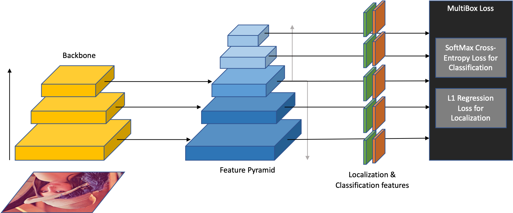

# 11785Project

<div align=center>
<div align=left>

An anchor-based object detection model which utilizes feature pyramid network (FPN) for semantic and spatial feature extraction.

# Instructions
Before running the model, kindly follow these steps to set things up:

## Dependencies
The following dependencies need to be satisfied to run the model:
- pytorch
- opencv-python
- addict
- tensorflow-gpu
- cython
- termcolor
- matplotlib

## General Setup
- Clone this repository.
```Shell
git clone https://github.com/qijiezhao/M2Det.git
```
- Compile the nms and coco tools:

```Shell
sh make.sh
```

- Prepare dataset (e.g., VOC, COCO), refer to [ssd.pytorch](https://github.com/amdegroot/ssd.pytorch) for detailed instructions.


## Training
The model can be trained using the following command:
```Shell
  python train.py -c=configs/320_resnet101.py -t True
```

## Evaluation
Once the model has been trained, a .pth file corresponding to the last epoch will be saved in the /data/weights/ directory. For example, let the saved file be named 'COCO_size320_netresnet101_epoch10.pth' The evaluation script is as follows:
```Shell
  python test.py -c=configs/320_resnet101.py -m=weights/COCO_size320_netresnet101_epoch10.pth
```
